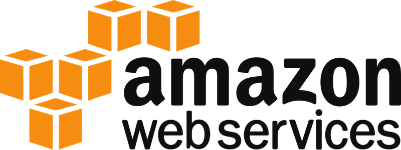

# Malachite's Guide to Amazon Web Services

[Find the AWS Console here](https://aws.amazon.com/console)

Amazon Web Service is the largest cloud-based IaaS (Infrastructure as a Service) architecture. It hosts virtual environments for individuals, companys and governments. These environments can vary from a single virtual machine to a whole virtual domain, with many servers and a
whole buch of services.

## User Account

One can create an AWS account free of charge, however an embossed credit card is needed.

[Create Account](https://portal.aws.amazon.com/billing/signup#/start)

## Elastic Beanstalk

EBS (Elastic Beanstalk) is an easy and compact way to run web applications encapsuled in
an OS + platform virtual box. We ill use this technology to run Docker Containers in AWS

#### EBS Administration Console 

It can be found under AWS > Services > Compute > Elastic Beanstalk

#### Deploying a Docker Container to AWS

Find the related guide [here](aws_setup.md)

## RDS

RDS stands for Relational Database Service It is Amazon's cloud-based database service. 
It is designed to simplify the setup, operation, and scaling of a relational database 
such as MySQL or MSSQL

#### RDS Administration Console 

It can be found under AWS > Services > Database > Relational Database Service

## S3

S3 is Amazon's Simple Storage Service which serves static files for webapplications and services

#### S3 Administration Console

It can be found under AWS > Services > Storage > S3

[Angular-frontend to S3 guide](Angular_Frontend_DevOps.md)
