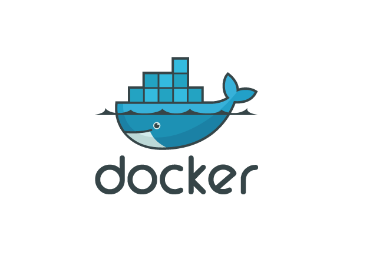

# Docker
**The blue whale of the interwebs**

Docker is an Operation-System-Level virtualization technology, enabling us to encapsule our web-applications into containers
and deploy them to web service providers such as [AWS](https://aws.amazon.com/) or [Azure](https://azure.microsoft.com/en-gb/free/?&qsg_sem_218257&WT.srch=1&wt.mc_id=AID660320_SEM_8h80VTnG&gclid=CjwKCAiAn5rUBRA3EiwAUCWb2xVZEKuh-or0NogOlM4aHtFEPfSkY2P1e_QQw_jxFcI9psBFj5S1_xoCGZoQAvD_BwE)

These containers can be built from [Docker images](http://blog.thoward37.me/articles/where-are-docker-images-stored/)

Containers are highly portable instances of Docker images; they can be run from your local machine, or deployed to another local computer / infrastructure, or deployed to a cloud-based service. And they operate the same on every given environment removeing the "but it works on my machine" from the game.

With these technologies building, deploying and maintaining your web application will be fast, scaleable and secure.

_____________________________________________________________________________________________________________________________________

## Installation
As Docker is highly scalable it can run on robust servers and on your PC too
provided it has 64bit architecture and OS, et least 4GB (**8GB is recomended**) of RAM, and hardware supported virtualization enabled (Check the Systeminfo, BIOS or UEFI for these informations)  

#### (please use the Stable version!)

### [Windows](https://docs.docker.com/docker-for-windows/install/)

### [Linux](https://github.com/DonBattery/Docker/blob/master/dockerguide.md)

### [Mac](https://docs.docker.com/docker-for-mac/)

_____________________________________________________________________________________________________________________________________

## Building Docker Images
[Docker CLI commands](Docker_Syntax.md)

[Creating a Dockerfile](Dockerfile.md)

As Docker has been installed on your machine, you can start to build Images from your applications with the help of a Dockerfile  

## Running Containers from Docker Images

As you run an image, Docker creates a new Container based on the image 
(containing the base OS, the environment and the appication  itself) and
starts it immediately.

The image can be local (if you have previously created it) or remote (from Dockerhub). If you run a remote image, Docker will download it to your computer first. 

See the [Docker_Syntax](Docker_Syntax.md) file for more information on how
to run images.

## Uploading Images to the Dockerhub

You need an account at [Dockerhub](https://hub.docker.com/) and you need
to be logged in (on your local machine) in order to push your Docker images

See the [Docker_Syntax](Docker_Syntax.md) file for more information on how
to login via CLI and push Docker images to Dockerhub  

## Deploying Docker Containers to a webservices (AWS)

You can deploy your Containers to AWS directly from your computer or throught a Docker repository with the help of a **Dockerrun.aws.json** file

[AWS Docker Guide](aws_setup.md)
