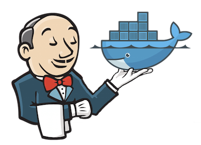
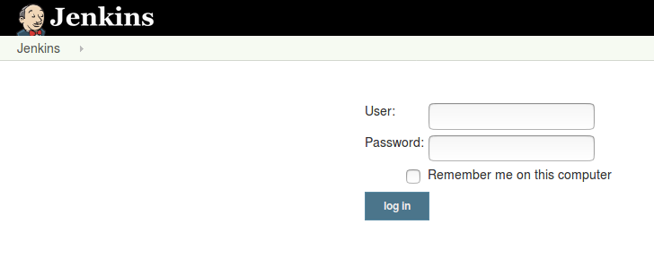
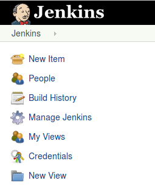
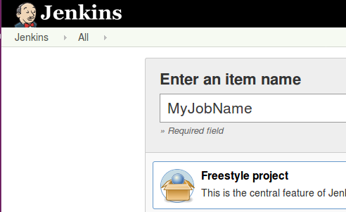

# Malachite's Guide to Jenkins

[](https://jenkins.io/)

Jenkins is an open-source automation server. Its goal to automatically build, test and deploy applications.
It can be set up to "listen" a version-control system (Git for example) and execute tasks based on the changes
of the repository being watched; for example when the development branch changes Jenkins pulls the repository,
builds the application, run the unit tests, and if there was no error during these steps it deploys the
application to another service (like Dockerhub or AWS)

## Húlí's Jenkins server
can be found on the Office network at **http://10.27.6.163:9090** \
or from the public Internet at **http://195.228.147.126:9090**

## Creating Webhook
In the GitHub repository of the project you have to add a webhook to connect Jenkins with the GitHub repo. The following article gives you a good understanding of the concept of webhook:\
https://developer.github.com/webhooks/ \
This tutorial helps you to create webhook:\
https://developer.github.com/webhooks/creating/ \
This video tutorial will guide you crystal clear through the process:\
https://www.youtube.com/watch?v=Z3S2gMBUkBo \
(hint: for the Payload URL use "http" instead of "https"!)

## Setting up a Jenkins server
DevOps team operates a physical server in Húlí which you can reach via a fix Internet IP address and its port:
**195.228.147.126:9090** (you also have to use this url for webhook as well) \
If necessary you can also download and install Jenkins on your machine as well. The link below will guide you through this procedure:\
https://jenkins.io/download/

## Creating Jenkins Account
A Jenkins account (username, password) will be provided for your project under the physical server's Admin account. When you have it go to the provided IP address and

### Login to Jenkins


### Then choose "New Item"


### Freestyle project is recommanded



### Creating a Jenkins Job
- add a "Project name",
- choose "GitHub project",
- the "Project url" is the browser address bar content of your GitHub repository,
- choose "This project is parameterized" and then "Credentials Parameter".
   - create a "Username with password" credential with your hub.docker credentials,
- in the "Source Code Management" panel choose "Git" and insert the GitHub cloning url of your project (pay attention that this url ends with .git),
- in "Build Triggers" choose "GitHub hook trigger for GITScm polling" option. (at this point you already have to have the webhook on GitHub),

- in "Build" panel choose "Docker Build and Publish". Add your "Repository name" and "Registry credentials",
- in "Add build step" choose "AWS Elastic Beanstalk"
   - add credentials and region, application and environment name,
   - in "Packaging" you can tell Jenkins to bundle into the .zip file only the Dockerrun.aws.json file if you are using Docker containers. For this in
      - "Root Object" field type "./",
      - "Includes" field type "Dockerrun.aws.json",
      - "Excludes" filed type all the other files with this syntax: "*/file1,file2,file3"
      (if you don't use docker just leave these fields blank and you can also ignore the "Docker Build and Publish" step above but in that case you have to configure the AWS environment type from Docker to your application's environment (Node.js, Java, etc.))
   - in "Version Label Format" type "${BUILD_TAG}" including the quotation marks as well
- then by clicking Apply > Save YOU'VE CREATED THE JENKINS JOB!!! :) 
\
Now give it a try to create a commit/push in your GitHub repository where the Dockerfile resides.


### FOR DEVELOPERS
This option uses the AWS EB CLI installed on Edward server Jenkins container. \
For this method first you have to insert AWS credentials into the 'credentials' file under '/.aws' folder on Edward server Jenkins container. For this run the following command:
```
aws configure
```

#### Now to continue you have two options to continue:
##### - use a .ZIP file that bundles all the files of your application (THIS IS THE DEFAULT PROCEDURE)
##### - use a Dockerrun.aws.json file (for this just create a .ebignore file in your GitHub repository in which you add all of the files except the Dockerrun.aws.json)
- in "Build" panel "Add build step" and choose
   - "Execute shell" and type in:
```
   eb init 'name-of-your-aws-application' --region eu-central-1 --source codecommit/'GitHub-username'/'GitHub-reponame'
   eb codesource local
```
   - then choose "Docker Build and Publish",
   - in "Repository name" field add your dockerhub repo name (example: greenfox/szera),
   - in "Registry credentials" add your dockerhub credentials,
- "Add build step" and choose "Execute shell" and type in:
```
   eb deploy
```
(if you want to deploy a Dockerrun.aws.json file instead of a .zip file than create an .ebignore file in your GitHub repository in which you add all of the files instead of the Dockerrun.aws.json)
#### If you have unittests: 
- start the building steps with 
   - "Execute shell" step with the following:
```
   docker build -t 'name-of-your-image' . 
   'write here all the CLI commands necessary to run the unittests'
```
   - then continue with "Docker Build and Publish" step, and *'eb deploy'* in "Execute shell" step. 
- then by clicking Apply > Save YOU'VE CREATED THE JENKINS JOB!!! :) 
\
Now give it a try to create a commit/push in your GitHub repository where the Dockerfile resides.
